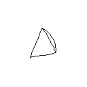
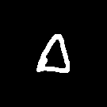

# Brandeis University COSI101A
# Fundamentals of Artificial Intelligence Final Project
## Handwritten Math Equations Recognition
## Acknowledgement
Thanks Professor Pengyu ,TA Zhihao Zheng and Jessica Lowell

## Final Report
By: Yutong Guo, Hangyan "Larry" Jiang and Jincheng Zhang

## Introduction
For this recent decade, there are more and more touch devices introduced into our life. For example, many of our classmates are using touch device (like surface) to take notes. For math, specifically, the demand of converting notes to latex is increasing. However, such tasks can be very difficult. CROHME, the competition for online features HME Recognition (though they also provide offline features in their database), has been there for years and we still cannot see any similar mature products on the market, but some systems can do it pretty well.
Recent years deep learning has proved its fame. The use of Convolutional Neural Network and Recurrent Neural Network largely accelerates the improvement in accuracy of computer visions. And as undergraduate students of COSI101A, we are quite interested in this project. However, we just got the first exposure to this field for about 3 months and we are not ambitious to make new discoveries. We followed the instructions from our instructor and TAs and also read some paper on this project. And hope we can find some interesting points that could be new and helpful to this project.

Our roadmap is quite clear for the first part: detect locations of the symbols. The first step is called data preparation, and this is where we pre-process the images from the training set. Each equation is divided into several images of symbols, and, furthermore, segmented images will go through two crucial precedures for future operation. During annotation, each image is labeled with the name of the original equation, from which it was abstracted, along with the symbol that it stands for, and lastly, the four coordinates of the symbol in the original picture.

Like the following: (Actually Segmentation can start at any point)

Segmentation -> Data -> Model (Classifier) ->  Locations and classes

## Data preparation
There are about 3500 training samples given. Considering that there are about or more than 30 categories to classify, the training set can be very small respectively.

Thus, getting more training samples could help a lot.

#### Data beyond the training set
**MINST**

From the last homework we used the MNIST dataset for digits, which works pretty well. There is also a data-augmented version called AlignMNIST(takes a long time to train but works really well).

But for this time we sought the superset of MNIST which includes English characters (we need it for a, b, x, y ..)

**NIST**

The NIST dataset provides huge samples for characters. It is unbalanced to some extent: letters like A has 30000+ samples and some only have 2000 samples.

We download the NIST dataset from the internet. It is really huge and unarchiving even takes 20min. The default dimension of each pic is 128\*128\*3.

We wrote a script to readin the raw data and take at most 5000 samples of each category. Then we map them in to a numpy zip file for further processing.

**CROHME**

Though we got characters dataset, math symbols dataset is still missing. CROHME provides a online feature data for math symbols. We download the extracted source from Kaggle.

Since it is extracted online feature, the raw data is like the following, 45\*45\*1 (Figure 1):

We need to convert it into offline features pic, making to more similar to a Handwritten one. Here we invert the color, apply GaussianBlur and opencv.dilate (increase the stroke thickness by convolute a 3\*3 window on it) (Figure 2):

(Note that these two are not the same sample but only an example)
```python
def format(img):
	#padding to 128 * 128, originally 45*45
	padding_top = 41
	padding_left = 42
	img = np.lib.pad(img, ((padding_top, padding_left),
		(padding_top, padding_left)), 'constant',
		constant_values=((255, 255), (255, 255)))

	#threshold and invert color
	ret, img = cv2.threshold(img, 127, 255, cv2.THRESH_BINARY_INV)

	#dilate
	kernel = np.ones((3,3),np.uint8)
	img = cv2.dilate(img,kernel,iterations = 2)

	img = cv2.GaussianBlur(img, (5, 5), 0)
	ret, img = cv2.threshold(img, 127, 255, cv2.THRESH_BINARY)

	return img
```

#### Problems encountered and what we gained

NIST is quite large, while CROHME is even more unbalanced. Symbols like Delta have only 100 samples.

First problem is the time of processing. It take a day long to read and append them in one numpy array.

Second problem is the unbalanced data. When finally we fed the data into keras with shuffle, and validation_split = 0.20 (20% as validation data), the Resnet-18 turns out to be quite robust, acchieving 99.5% acc on training set, but only 10% on the training data. That's a disaster. Too unbalanced data lead to majority of one category sample yielded to the validation and the result is so bad.

For the first problem, we used several methods to improve the performance and it turns out that following is quite powerful:

1. Multithreading
2. Pre-allocate numpy array memory

Examples using multiprocessing in python to parallelize computing (also with opencv):
```python
#start single process for each label
p = Process(target=readin, args=(imgs, label))
p.start()

#for p in ps: p.join()
#Thread pool map for mapping an array
def resize(img):
    img = cv2.cvtColor( img, cv2.COLOR_RGB2GRAY )
    return cv2.resize(img, (32, 32), interpolation = cv2.INTER_AREA)
new_x = pool.map(resize, x)
```
In practice, pre-alloc helps a lot. When `np.append()` needs to resize the array, a larger array is allocated just in time and every time we need to copy the original data to the new array which is both time-space consuming. Since we finally resize the image to 32*32*1, we know the exact memory we need and we can initialize a numpy empty array at first.

#### Work done on the training set

DataPreparation/data_train_raw.py

First read in and apply GuassianBlur and Threshold.

Then Padding to square and resize to 28*28.

Finally padding to 32*32, save imgs to npz-x, labels to npz-y

## Model/Classifier

A Convolutional Neural Network is used to predict each symbol. Training set is used.

#### CNN Architecture

The architecture is a little bit improved from the one from the last homework.
The traditional LeNet 5\*5 kernel is replaced by two 3\*3 windows, which provide more detailed early detection and non-linearity.

So the architecture becomes:
3\*3-32 -> 3\*3-64 -> max pooling 2\*2 -> batchNorm -> 3\*3-32 -> 3\*3-64 -> max pooling 2\*2 -> batchNorm -> dropout -> fully connected -> readout softmax

ReLu is mostly used for fast training and non-linearity.
BatchNorm is for efficient training and some kind of preventing overfitting.
Dropout is for preventing overfitting.

#### Residual Network
A Resnet-34 architecture NN is also trained. It provides the same acc (88%) on 20% validation as of previous CNN. So Resnet would be a little bit overkill for this problem. The weights file of this resnet-34 is about 80MB, too large for github.
The code of keras resnet is provided in the Model folder.

Credit to https://github.com/raghakot/keras-resnet/blob/master/resnet.py

#### Data Augmentation
Since our training set is well refined and our future image will be centered by padding. Random shift is disabled. Rotation is allowed for 10 degrees. It is done in real time in keras training.

#### Label Encoder
A scikit-learn label encoder is used for accomodation all symbol categories labels. Converting automatically from string to numerical and LE provides inverse transform.

```python
le = preprocessing.LabelEncoder()
le.fit(y)
t_y = le.transform(y)
num_classes = len(le.classes_)
le.inverse_transform(0) # -> a
```

## Segmentation
